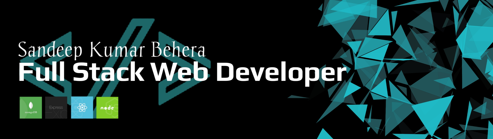

<h1 align="center">Hi 👋, I'm Sandeep Kumar Behera</h1>
<h3 align="center">A Passionate Full Stack Web Developer</h3>

---

### 🚀 About Me

🔹 A highly motivated **Full Stack Developer** with expertise in **React, React Native, Next.js, and the MERN stack**.  
🔹 Passionate about crafting **beautiful and scalable** web applications with clean and efficient code.  
🔹 Strong understanding of **Data Structures & Algorithms** and keen on problem-solving.  
🔹 Experience in **project leadership, CI/CD integration, and Agile/Scrum methodologies**.  

📖 **Currently Learning:** Advanced **MERN Stack** concepts & DevOps practices.  
📫 **Reach me at:** [Email](mailto:sandeepbeherakbl@gmail.com)  

---

<h2 align="center">⚡ Tech Stack</h2>

  
  
  
  
  
  
  
  
  
  
  
  
  

---

<h2 align="center">📊 GitHub Stats</h2>

  
  

  

---

<h2 align="center">📬 Connect with Me</h2>

    
    
    

---

⭐ **Fun Fact:** *Code is like humor. When you have to explain it, it’s bad!* 😆

🔥 **Let's build something amazing together!** 🚀
